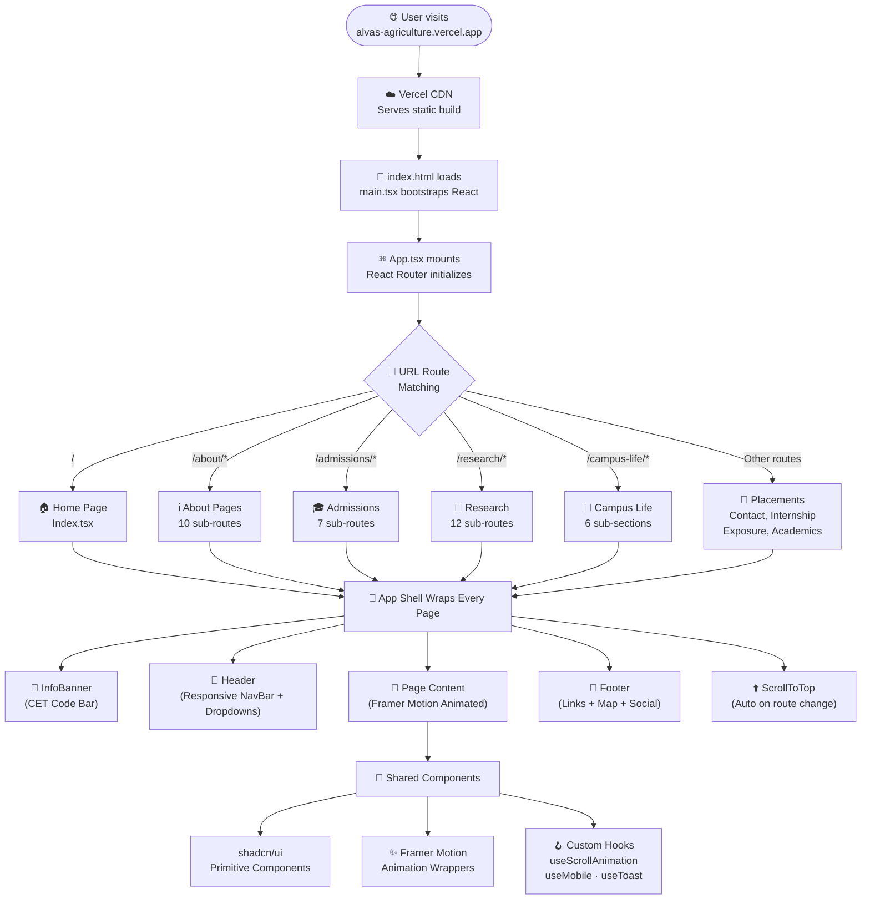

<div align="center">


<br/><br/>

# 🌾 ALVA'S INSTITUTE OF AGRICULTURAL SCIENCES & TECHNOLOGY

### *Cultivating Knowledge. For a Bumper Harvesting.*

<br/>

[](https://alvas-agriculture.vercel.app)
[](https://react.dev)
[](https://www.typescriptlang.org)
[](https://vitejs.dev)
[](https://tailwindcss.com)
[](https://vercel.com)

<br/>

> **Alva's Agricultural College, Moodbidri** — A premier institution dedicated to excellence in agricultural education, research, and rural development under the Alva's Education Foundation.  
> Affiliated to Keladi Shivappa Nayaka University of Agricultural and Horticultural Sciences, Iruvakki, Shivamogga.

<br/>

---

</div>

## 📌 Table of Contents

- [🌟 Overview](#-overview)
- [📸 Website Preview](#-website-preview)
- [✨ Features](#-features)
- [🏗️ Architecture](#-architecture)
- [🗂️ File Structure](#-file-structure)
- [🛠️ Technology Stack](#-technology-stack)
- [🔄 Flowchart](#-flowchart)
- [⚡ Getting Started](#-getting-started)
- [🚀 Live Deployment](#-live-deployment)
- [👨‍💻 Built By](#-built-by)

---

## 🌟 Overview

The **Alva's IAST Official Website** is a fully responsive, modern institutional web application built for **Alva's Institute of Agricultural Sciences & Technology, Moodbidri**. It serves as the primary digital presence for the institution — providing prospective students, faculty, and the public with comprehensive information about academic programs, admissions, research, campus life, placements, and more.

The website was built with a premium design philosophy — blending a warm earthy color palette, smooth Framer Motion animations, and a clean content hierarchy to represent the institution's prestige and forward-thinking vision.

### 🎯 Key Highlights

| Field | Details |
|---|---|
| 📍 **Institution** | Alva's Institute of Agricultural Sciences & Technology (IAST) |
| 📍 **Location** | Moodbidri, Dakshina Kannada, Karnataka — 574227 |
| 🎓 **Programs** | B.Sc. (Hons) Agriculture · B.Tech. Food Technology |
| 🏛️ **Affiliation** | KSKVKU, Shivamogga · UGC · ICAR · NAAC |
| 📞 **Contact** | +91 8258 238 900 · info@alvas.org |
| 🌐 **Live Website** | [alvas-agriculture.vercel.app](https://alvas-agriculture.vercel.app) |

---

## 📸 Website Preview

### 🏠 Homepage — Hero Section
> *"Cultivating Knowledge. For a Bumper Harvesting."*


---

### 🏛️ About — Legacy of Agricultural Excellence


---

### 🎓 Admissions — KCET & Management Quota


---

### 🔬 Research — Discovery & Innovation


---

### 🌿 Campus Life — 100 Acres in the Western Ghats


---

### 💼 Placements — Bridges to Success


---

### 🏫 Facilities — Smart Classrooms, Labs & Research Farms


---

### 📬 Footer — Quick Links, Contact & Location


---

## ✨ Features

### 🖥️ Pages & Sections

| Module | Pages / Sections |
|---|---|
| **🏠 Home** | Hero Banner · About Snapshot · Courses · Facilities Carousel · Admissions CTA · Gallery · Placements |
| **ℹ️ About** | Institution Overview · Vision & Mission · Chairman's Message · Dean's Message · Administration · AEF · Milestones · MoU · Affiliations · NAAC |
| **🎓 Admissions** | KCET · Management Quota · Documents Required · Tuition Fees · Scholarship Schemes |
| **📚 Academics** | B.Sc. (Hons) Agriculture · B.Tech. Food Technology · Department Pages |
| **🔬 Research** | R&D Cell · Publications · Journals · Funding · IPR · Patents · Research Team · Supervisors |
| **🌿 Campus Life** | Overview · Green Campus · Library · Residential Life · Skill Labs · Sports & Culture · Startups |
| **💼 Placements** | Placement Cell · Industry Connect · Past Recruiters |
| **🚌 Exposure Visit** | Field Trips · Educational Tours |
| **🏭 Internship/IPT** | In-Plant Training Details |
| **📞 Contact Us** | Map · Contact Form · Quick Info |

### ⚙️ Technical Features

- ✅ **Fully Responsive** — Works perfectly on mobile, tablet, and desktop
- ✅ **Framer Motion Animations** — Smooth scroll-triggered animations on every page
- ✅ **React Router DOM** — Client-side navigation with nested routing
- ✅ **Scroll-to-Top** — Automatic scroll restoration on route change
- ✅ **Info Banner** — CET code & admissions enquiry persistent bar
- ✅ **Interactive Navigation** — Dropdown menus with smooth hover states
- ✅ **Google Maps Embed** — Integrated campus location map in footer
- ✅ **Social Media Links** — Facebook, YouTube, Instagram, Twitter, WhatsApp
- ✅ **SEO Ready** — Semantic HTML5, descriptive headings, proper meta structure
- ✅ **shadcn/ui Components** — 30+ accessible, production-ready UI primitives

---

## 🏗️ Architecture

```mermaid
graph TD
    User(["👤 User Browser"]):::user

    subgraph Vercel ["☁️ Vercel Cloud (CDN)"]
        Build["📦 Static Build\n(dist/)"]
    end

    subgraph App ["⚛️ React SPA — Vite + TypeScript"]
        direction TB
        Entry["🚪 main.tsx\nApp Entry Point"]

        subgraph Layout ["🔲 App Shell — App.tsx"]
            InfoBanner["📢 InfoBanner\n(CET Code Bar)"]
            Header["🧭 Header\n(Navigation + Dropdowns)"]
            ScrollTop["⬆️ ScrollToTop"]
            Footer["🦶 Footer\n(Links + Map + Social)"]
        end

        subgraph Router ["🔀 React Router DOM v6"]
            Home["🏠 /\nIndex.tsx"]
            About["ℹ️ /about/*\n10+ Sub-pages"]
            Admissions["🎓 /admissions/*\n6 Sub-pages"]
            Academics["📚 /academics/*\n2 Programs"]
            Research["🔬 /research/*\n12 Sub-pages"]
            Campus["🌿 /campus-life/*\n6 Sub-pages"]
            Placement["💼 /placement"]
            Exposure["🚌 /exposure"]
            Internship["🏭 /internship"]
            Contact["📞 /contact"]
        end

        subgraph Components ["🧩 Reusable Components"]
            Hero["HeroSection"]
            Facilities["FacilitiesSection"]
            Gallery["GallerySection"]
            PlaceSec["PlacementsSection"]
            PageHero["PageHero\n(Shared Banner)"]
        end

        subgraph UILayer ["🎨 UI & Animation Layer"]
            ShadCN["shadcn/ui\n30+ Components"]
            Framer["Framer Motion\nAnimations"]
            Tailwind["TailwindCSS\nStyling"]
        end

        subgraph Hooks ["🪝 Custom Hooks"]
            ScrollHook["useScrollAnimation"]
            MobileHook["useMobile"]
            ToastHook["useToast"]
        end
    end

    User -->|"HTTPS Request"| Vercel
    Vercel -->|"Serves HTML/JS/CSS"| Entry
    Entry --> Layout
    Layout --> Router
    Router --> Components
    Components --> UILayer
    Router --> Hooks

    classDef user fill:#16a34a,stroke:#15803d,color:#fff,rx:10
    classDef cloud fill:#1e40af,stroke:#1d4ed8,color:#fff
    classDef default fill:#1f2937,stroke:#374151,color:#e5e7eb
```



---

## 🗂️ File Structure

```
alvas_agriculture/
│
├── 📄 index.html                    # App entry point
├── 📄 package.json                  # Dependencies & scripts
├── 📄 vite.config.ts                # Vite configuration
├── 📄 tailwind.config.ts            # Design tokens & theme
├── 📄 tsconfig.json                 # TypeScript config
├── 📄 vercel.json                   # Vercel SPA routing config
├── 📄 components.json               # shadcn/ui component config
│
├── 📁 public/                       # Static assets (served as-is)
│   ├── alvas-org-logo-white.png     # Institution logo
│   ├── preview/                     # README screenshots
│   │   ├── home.png
│   │   ├── about.png
│   │   ├── admissions.png
│   │   ├── research.png
│   │   ├── campus.png
│   │   ├── placement.png
│   │   ├── gallery.png
│   │   └── footer.png
│   └── [100+ campus images & assets]
│
└── 📁 src/
    ├── 📄 main.tsx                  # React bootstrapper
    ├── 📄 App.tsx                   # Root router & shell layout
    ├── 📄 index.css                 # Global styles & CSS variables
    │
    ├── 📁 components/               # Reusable UI Components
    │   ├── Header.tsx               # Navigation bar with dropdowns
    │   ├── Footer.tsx               # Site-wide footer
    │   ├── HeroSection.tsx          # Animated homepage hero
    │   ├── AdmissionsSection.tsx    # CTA admissions block
    │   ├── FacilitiesSection.tsx    # Interactive facilities carousel
    │   ├── GallerySection.tsx       # Photo gallery grid
    │   ├── PlacementsSection.tsx    # Placement stats & recruiters
    │   ├── ResearchSection.tsx      # Research highlights
    │   ├── StudentLifeSection.tsx   # Campus life snapshot
    │   ├── InfoBanner.tsx           # Top CET code sticky bar
    │   ├── PageHero.tsx             # Reusable page banner hero
    │   ├── PageBackground.tsx       # Shared page background layer
    │   ├── ScrollToTop.tsx          # Scroll restoration on nav
    │   ├── NavLink.tsx              # Custom nav link component
    │   ├── milestones/              # Milestone tab components
    │   │   ├── MilestonesTabs.tsx
    │   │   ├── ChronologicalPanel.tsx
    │   │   ├── YearGridPanel.tsx
    │   │   └── MapViewPanel.tsx
    │   └── ui/                      # shadcn/ui components (30+)
    │       ├── button.tsx, card.tsx, tabs.tsx ...
    │
    ├── 📁 pages/                    # Route-level Page Components
    │   ├── Index.tsx                # Homepage
    │   ├── NotFound.tsx             # 404 page
    │   ├── about/                   # About section (10 pages)
    │   ├── admissions/              # Admissions section (7 pages)
    │   ├── academics/               # Academic programs (2 pages)
    │   ├── research/                # Research section (12 pages)
    │   ├── campus-life/             # Campus life (6 sub-sections)
    │   ├── placement/               # Placements page
    │   ├── exposure/                # Exposure visits page
    │   ├── internship/              # Internship/IPT page
    │   └── contact/                 # Contact us page
    │
    ├── 📁 hooks/                    # Custom React Hooks
    │   ├── useScrollAnimation.ts    # IntersectionObserver animation
    │   ├── use-mobile.tsx           # Responsive breakpoint hook
    │   └── use-toast.ts             # Toast notification hook
    │
    ├── 📁 lib/
    │   └── utils.ts                 # Tailwind merge utility (cn)
    │
    └── 📁 test/
        ├── setup.ts                 # Vitest test configuration
        └── example.test.ts          # Example unit test
```

---

## 🛠️ Technology Stack

| Category | Technology | Version | Purpose |
|---|---|---|---|
| **⚛️ Framework** | React | 18.3 | UI component framework |
| **🔷 Language** | TypeScript | 5.8 | Type-safe development |
| **⚡ Build Tool** | Vite | 5.4 | Fast dev server & bundler |
| **🎨 Styling** | Tailwind CSS | 3.4 | Utility-first CSS framework |
| **🧩 UI Library** | shadcn/ui + Radix UI | Latest | Accessible component primitives |
| **✨ Animation** | Framer Motion | 11.18 | Scroll & entrance animations |
| **🔀 Routing** | React Router DOM | 6.30 | Client-side navigation |
| **🖼️ Icons** | Lucide React | 0.462 | Modern icon library |
| **🖼️ Icons** | React Icons | 5.5 | Extended icon sets |
| **📝 Forms** | React Hook Form + Zod | Latest | Form validation & schemas |
| **📊 Charts** | Recharts | 2.15 | Data visualization |
| **🔔 Toasts** | Sonner | 1.7 | Toast notifications |
| **🧪 Testing** | Vitest + Testing Library | Latest | Unit & component tests |
| **🚀 Deployment** | Vercel | — | CI/CD & global CDN hosting |
| **📦 Package Mgr** | npm | — | Dependency management |

---

## 🔄 Flowchart



---

## ⚡ Getting Started

### Prerequisites

- [Node.js](https://nodejs.org/) `v18+`
- [npm](https://www.npmjs.com/) `v9+`

### Installation & Running Locally

```bash
# 1. Clone the repository
git clone https://github.com/abhishek-ms-01/alvas_agriculture.git

# 2. Navigate to the project directory
cd alvas_agriculture

# 3. Install all dependencies
npm install

# 4. Start the development server
npm run dev
```

The app will be available at **[http://localhost:8080](http://localhost:8080)**

### Available Scripts

```bash
npm run dev        # Start development server (localhost:8080)
npm run build      # Build for production (output: dist/)
npm run preview    # Preview production build locally
npm run lint       # Run ESLint checks
npm test           # Run unit tests with Vitest
```

---

## 🚀 Live Deployment

| Environment | URL |
|---|---|
| 🌐 **Production** | [https://alvas-agriculture.vercel.app](https://alvas-agriculture.vercel.app) |
| 📦 **Repository** | [github.com/abhishek-ms-01/alvas_agriculture](https://github.com/abhishek-ms-01/alvas_agriculture) |

> Deployed on **Vercel** with automatic CI/CD — every push to the `main` branch triggers a new deployment automatically.

---

## 👨‍💻 Built By

<div align="center">

<br/>

<table>
  <tr>
    <td align="center" width="300">
      <br/>
      <b>🧑‍💻 Abhishek M S</b><br/><br/>
      <sub>Lead Developer · UI/UX Design · Architecture</sub><br/><br/>
      <a href="https://github.com/abhishek-ms-01">
        
      </a>
    </td>
    <td align="center" width="300">
      <br/>
      <b>🧑‍💻 Omkar K S</b><br/><br/>
      <sub>Developer · Content Strategy · Research</sub><br/><br/>
      
    </td>
  </tr>
</table>

<br/>

---

*Built with ❤️ for **Alva's Institute of Agricultural Sciences & Technology**, Moodbidri*

<br/>

[](https://react.dev)
[](https://tailwindcss.com)
[](https://vercel.com)

<br/>

**© 2026 Alva's Institute of Agricultural Science & Technology, Moodbidri. All Rights Reserved.**

</div>
